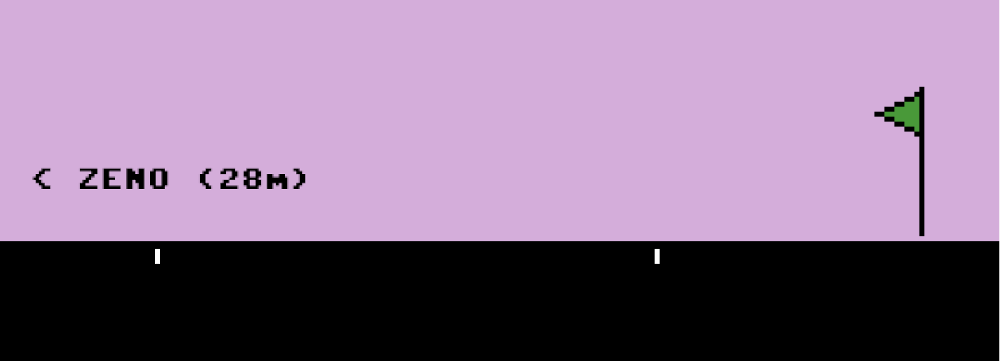

# *Let's Play: Ancient Greek Punishment: Inversion Edition*

# [Play Online](https://www.pippinbarr.com/lets-play-ancient-greek-punishment-inversion-edition/) (Desktop only)

## Description
*Torment characters from Greek mythology! Forever! Push Sisyphus back down the hill! Peck out Prometheus’s liver! Withhold the apple from Tantalus! Albert Camus said we must imagine Sisyphus happy! So the boulder must be even happier! Right?!*

_Let's Play: Ancient Greek Punishment: Inversion Edition_ is a new edition in the _Let's Play: Ancient Greek Punishment_ series, focusing on a retelling of five (kind of) mythological punishments. In the _Inversion Edition_ the role of the player is switched from the tormented to the tormentor, but is it really any better? Is Sisyphus happy? Is the boulder?

## Press
- Gita Jackson. [A Game Where You Are The Boulder Sisyphus Must Push](https://kotaku.com/a-game-where-you-are-the-boulder-sisyphus-must-push-1832165226). Kotaku. 29 January 2019.
- Michał Tomaszkiewicz. [Dzięki tej grze możesz znęcać się nad Syzyfem, Prometeuszem i Tantalem
Więcej: https://www.antyradio.pl/Technologia/Gry/Dzieki-tej-grze-mozesz-znecac-sie-nad-Syzyfem-Prometeuszem-i-Tantalem-28896](https://www.antyradio.pl/Technologia/Gry/Dzieki-tej-grze-mozesz-znecac-sie-nad-Syzyfem-Prometeuszem-i-Tantalem-28896). Antyradio.pl. 30 January 2019. (In Polish.)

Read the [Press kit](https://github.com/pippinbarr/lets-play-ancient-greek-punishment-inversion-edition/blob/master/press/README.md) for press information

## Documentation
* Read the [Process documentation](https://github.com/pippinbarr/lets-play-ancient-greek-punishment-inversion-edition/blob/master/process/README.md) for process journal, to do list, research questions, and related work
* Read the [Commit History](https://github.com/pippinbarr/lets-play-ancient-greek-punishment-inversion-edition/commits/master) for step-by-step information about how the project was built
* Look at the [Code Repository](https://github.com/pippinbarr/lets-play-ancient-greek-punishment-inversion-edition) for source code etc.

## License
_Let's Play: Ancient Greek Punishment: Inversion Edition_ is an open source game licensed under a [Creative Commons Attribution-NonCommercial 3.0 Unported License](http://creativecommons.org/licenses/by-nc/3.0/). You can obtain the source code from its [code repository](https://github.com/pippinbarr/lets-play-ancient-greek-punishment-inversion-edition) on GitHub.
