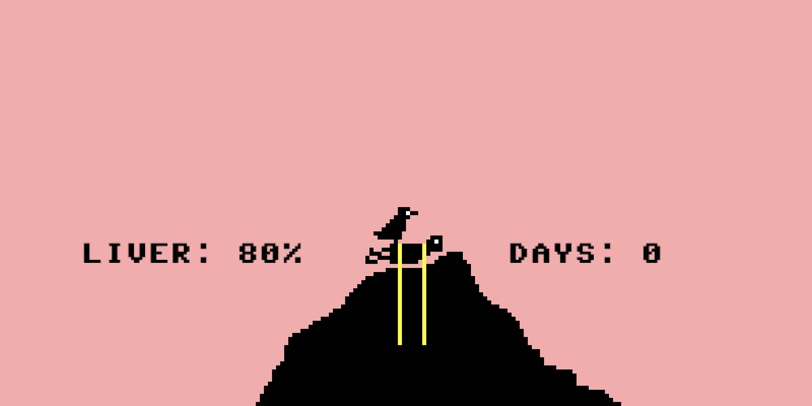
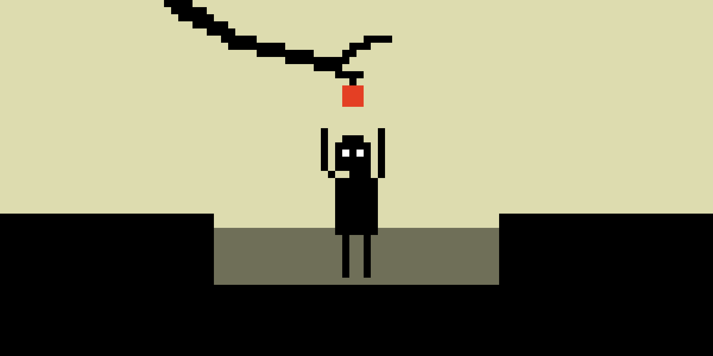
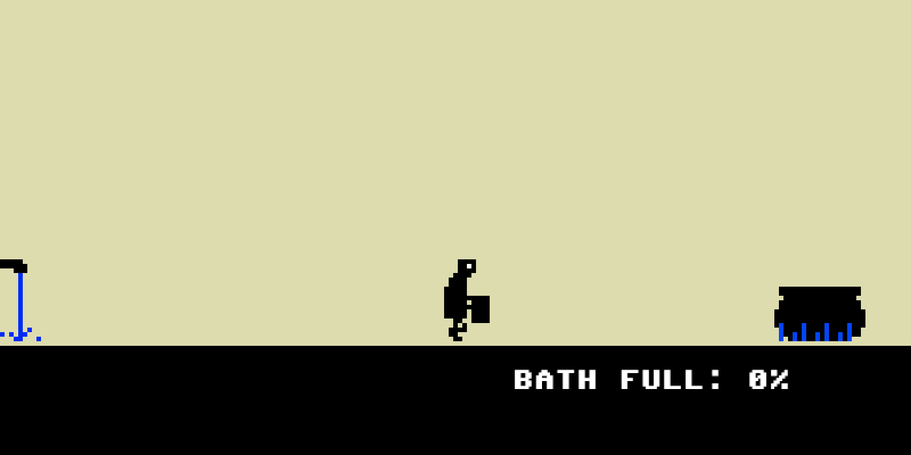
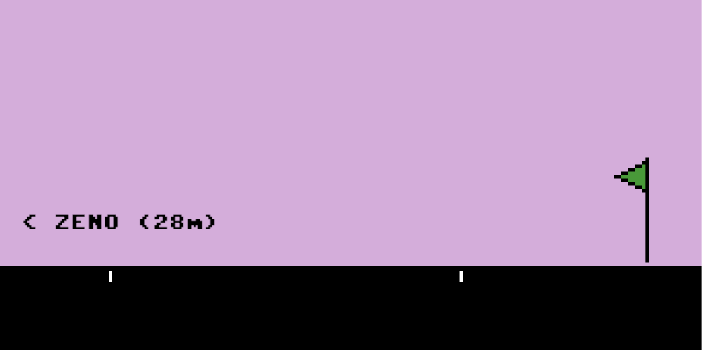

# _Let's Play: Ancient Greek Punishment: Inversion Edition_ Press Kit

#### [Play _Let's Play: Ancient Greek Punishment: Inversion Edition_](https://pippinbarr.github.io/lets-play-ancient-greek-punishment-inversion-edition)

## The basics

* Developer: [Pippin Barr](http://www.pippinbarr.com/)
* Release: 29 January 2019
* Platform: Browser (desktop only)
* Code repository: https://github.com/pippinbarr/lets-play-ancient-greek-punishment-inversion-edition
* Price: $0.00

## Who is this Pippin Barr guy?

Pippin is an experimental game developer who has made games about everything from [Eurovision](http://www.pippinbarr.com/2012/03/27/epic-sax-game/) to [performance art](http://www.pippinbarr.com/2011/09/14/the-artist-is-present/) to [dystopian post-work futures](http://www.pippinbarr.com/games/2017/07/03/it-is-as-if-you-were-doing-work.html). He's an Assistant Professor in the [Department of Design and Computation Arts](http://www.concordia.ca/finearts/design.html) at [Concordia University](http://www.concordia.ca/) in Montréal. He is also the associate director of the [Technoculture, Art, and Games (TAG)](http://tag.hexagram.ca/) Research Centre, which is part of the [Milieux Institute for Arts, Culture, and Technology](http://milieux.concordia.ca/).

## Description

_Torment characters from Greek mythology! Forever! Push Sisyphus back down the hill! Peck out Prometheus's liver! Withhold the apple from Tantalus! Albert Camus said we must imagine Sisyphus happy! So the boulder must be even happier! Right?!_

---

_Let's Play: Ancient Greek Punishment: Inversion Edition_ is another edition in the _Let's Play: Ancient Greek Punishment_ series begun in 2011 and comprising: [Let's Play: Ancient Greek Punishment](http://www.pippinbarr.com/games/letsplayancientgreekpunishment/LetsPlayAncientGreekPunishment.html) (2011), [Let's Play: Ancient Greek Punishment: Art Edition Edition](http://www.pippinbarr.com/games/letsplayletsplayancientgreekpunishmentarteditionedition/) (2015), [Let's Play: Ancient Greek Punishment: Limited Edition](http://www.pippinbarr.com/games/letsplayancientgreekpunishmentlimitededition/) (2016), [Let's Play: Ancient Greek Punishment: CPU Edition](http://pippinbarr.github.io/letsplayancientgreekpunishmentcpuedition/) (2017). In the _Inversion Edition_ the player takes on the role of the oppressor/tormentor who ensures the eternal punishment of the traditional protagonist. Thus you become the boulder that attempts to push Sisyphus back down the hill, the eagle that pecks out Prometheus's liver, or the flag the marks the end of Zeno's footrace. At heart, beyond the basic gag of a role reversal, the game is about asking the key question: in a game of eternal punishment, isn't it just as bad for the punisher as the punished?

## History

I started _Let's Play: Ancient Greek Punishment: Inversion Edition_ as a way to kick of 2019 with a different spirit to 2018. 2018 was a tough year for me in terms of trying to be a little too serious and "worthy" in many of my projects and I wanted to make something that, at a base level, just made me laugh. It worked! I find it pretty hilarious. In fact, I've enjoyed rethinking these punishment games so much I have it in mind to make yet more of them, devoting the entire year to it if need be. We'll see.

_Let's Play: Ancient Greek Punishment: Inversion Edition_ is also a continuation of my project to apply the game development documentation approach I've been working on with my colleagues Rilla Khaled and Jonathan Lessard. We've come to call this approach the [MDMA](http://www.gamesasresearch.com/mdma) (for me it stands for _Method for Design Materialisation and Analysis_) and it forms a fundamental part of our [Games as Research](http://www.gamesasresearch.com/) project. By making a small and nicely self-contained project, I figured it would be a good way to demonstrate the documentation process. So, if you want to, you can read a lot about the game's development by reading its [process documentation](https://github.com/pippinbarr/lets-play-ancient-greek-punishment-inversion-edition/blob/master/process/README.md) and by going through its [commit history](https://github.com/pippinbarr/lets-play-ancient-greek-punishment-inversion-edition/commits/master).

## Technology

_Let's Play: Ancient Greek Punishment: Inversion Edition_ was created in JavaScript using the [Phaser 3](https://phaser.io/) game development framework.

_Let's Play: Ancient Greek Punishment: Inversion Edition_ is an open source game licensed under a [Creative Commons Attribution-NonCommercial 3.0 Unported License](http://creativecommons.org/licenses/by-nc/3.0/). You can obtain the source code from its [code repository](https://github.com/pippinbarr/lets-play-ancient-greek-punishment-inversion-edition) on GitHub.

## Features

- Rolling!
- Pecking!
- Emptying!
- Running!
- Bathing!
- Eating!
- Infinite punishment!

### Trailer

## Images

## Press

- Gita Jackson. [A Game Where You Are The Boulder Sisyphus Must Push](https://kotaku.com/a-game-where-you-are-the-boulder-sisyphus-must-push-1832165226). Kotaku. 29 January 2019.
- Michał Tomaszkiewicz. [Dzięki tej grze możesz znęcać się nad Syzyfem, Prometeuszem i Tantalem
Więcej: https://www.antyradio.pl/Technologia/Gry/Dzieki-tej-grze-mozesz-znecac-sie-nad-Syzyfem-Prometeuszem-i-Tantalem-28896](https://www.antyradio.pl/Technologia/Gry/Dzieki-tej-grze-mozesz-znecac-sie-nad-Syzyfem-Prometeuszem-i-Tantalem-28896). Antyradio.pl. 30 January 2019. (In Polish.)

## Additional Links

- [Process documentation of _Let's Play: Ancient Greek Punishment: Inversion Edition_](https://github.com/pippinbarr/lets-play-ancient-greek-punishment-inversion-edition/blob/master/process/README.md)
- [Commit history of _Let's Play: Ancient Greek Punishment: Inversion Edition_](https://github.com/pippinbarr/lets-play-ancient-greek-punishment-inversion-edition/commits/master)
- [Let's Play: Ancient Greek Punishment](http://www.pippinbarr.com/games/letsplayancientgreekpunishment/LetsPlayAncientGreekPunishment.html) (2011)
- [Let's Play: Ancient Greek Punishment: Art Edition Edition](http://www.pippinbarr.com/games/letsplayletsplayancientgreekpunishmentarteditionedition/) (2015)
- [Let's Play: Ancient Greek Punishment: Limited Edition](http://www.pippinbarr.com/games/letsplayancientgreekpunishmentlimitededition/) (2016)
- [Let's Play: Ancient Greek Punishment: CPU Edition](http://pippinbarr.github.io/letsplayancientgreekpunishmentcpuedition/) (2017)

## Credits

* Pippin Barr: everything?

## Contact

* Email: [pippin.barr+press@gmail.com](mailto:pippin.barr+press@gmail.com)
* Website: [www.pippinbarr.com](http://www.pippinbarr.com/)
* Twitter: [@pippinbarr](https://www.twitter.com/pippinbarr)
* Instagram: [@pippinbarr](https://www.instagram.com/pippinbarr)
* Facebook: [Pippin Barr](http://www.facebook.com/pippin.barr)
